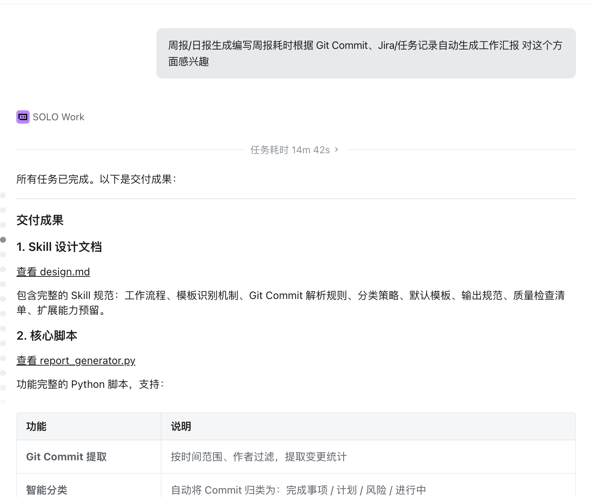
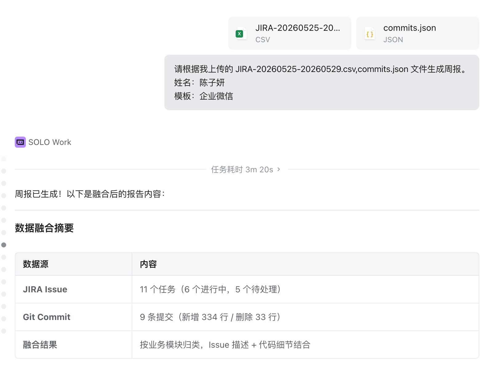
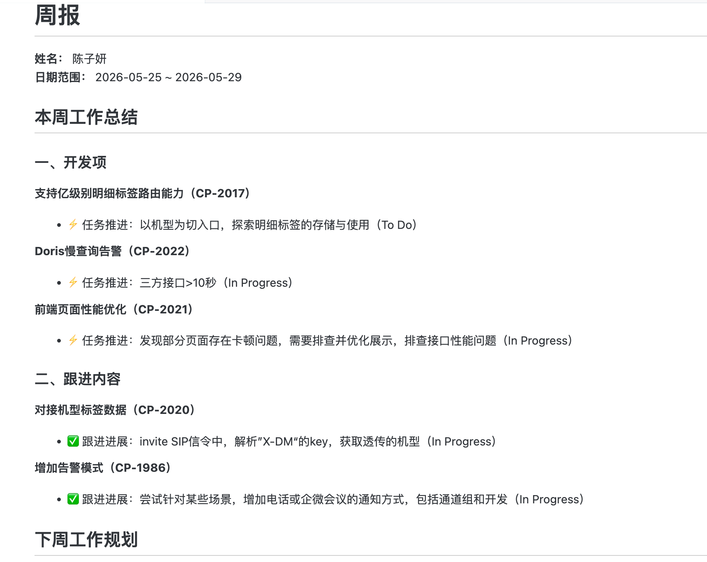
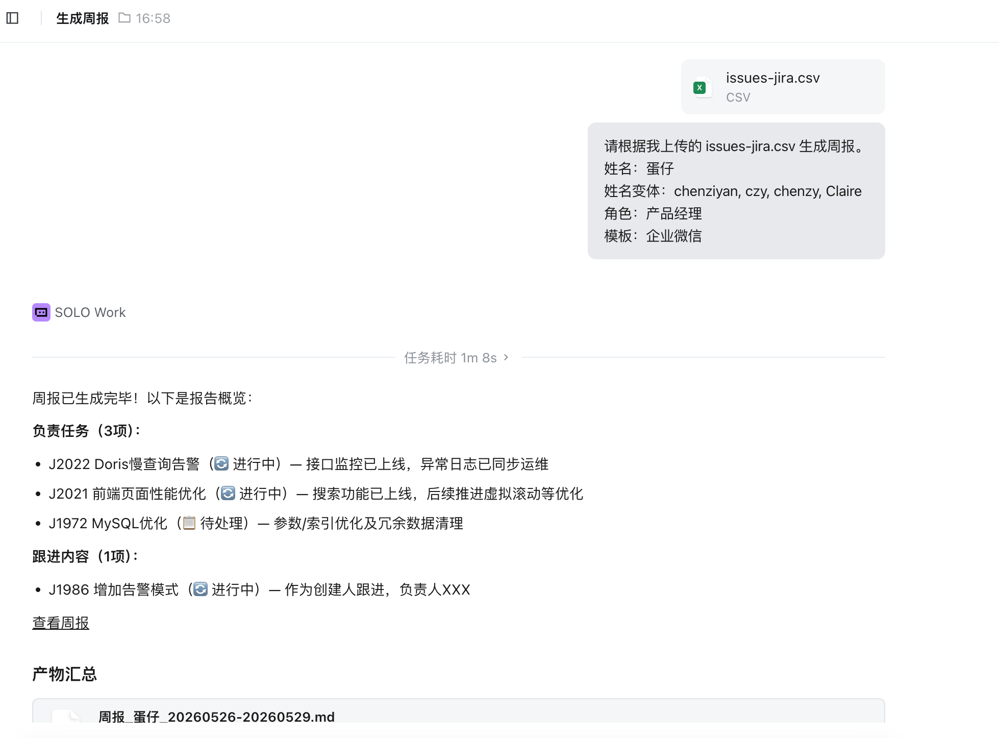
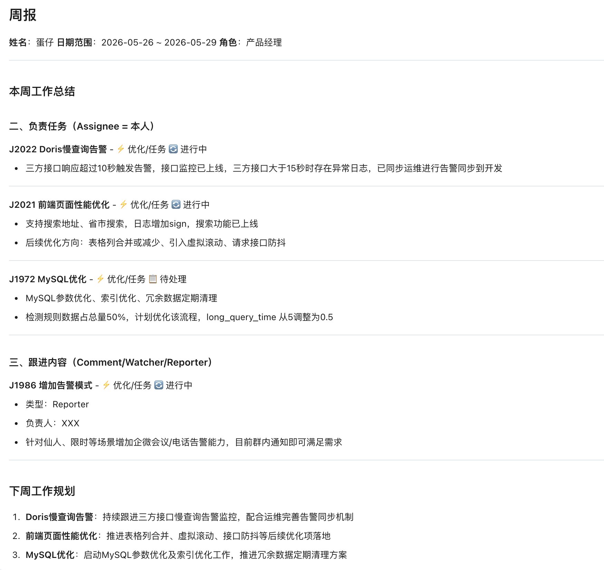
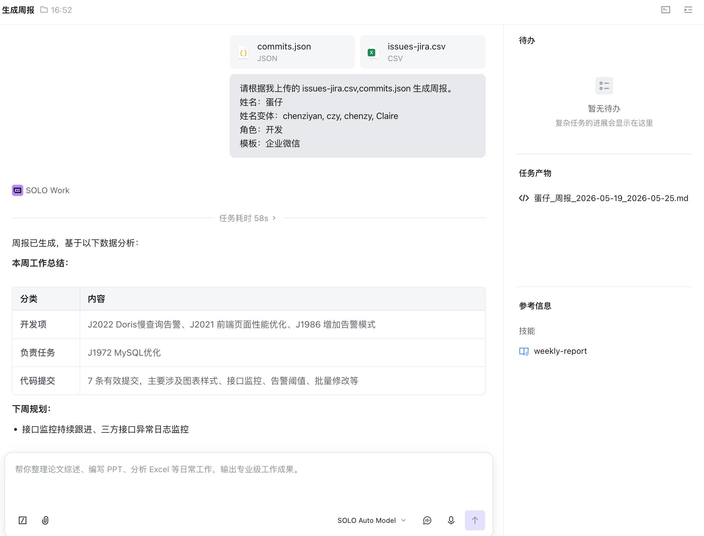
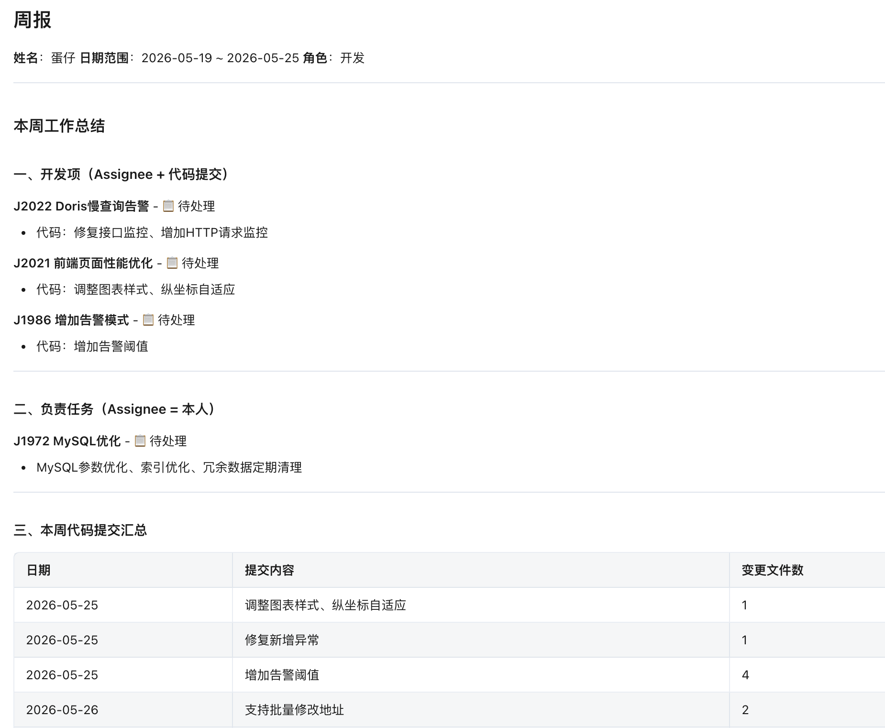

# 【Skill 创作】告别手写周报！项目+开发双维度自动生成，全程不用动脑、丢数据即出稿
## 一、Skill 简介
这是一款**面向全角色、多维度、全自动的周报/日报生成 Skill**，支持**项目/产品、技术/开发、测试、项目经理**等不同岗位，自动整合**项目管理工具数据 + 源代码管理工具数据**，双轨筛选负责事项与跟进内容，**只需要上传留痕数据，AI 直接输出完整规范报告**，周报更精准、日报更快捷。

## 二、使用场景
### 为什么做它
每周写总结都在**回忆—查漏—补全—排版**上浪费大量时间：
- 产品/项目：只记得核心需求，**漏跟进、漏评审、漏协作**，每次写周报，除了总览JIRA任务进展，还要观察备注的进度，结合成员写的周报，花了挺多时间，再写项目周报，明确进展、问题、解决方法等，又耗时，人为描述可能遗漏
- 开发/技术：只记得写代码，**说不清任务关联、讲不清进度价值**，每次写周报都要先纵览一下JIRA和GIT，看看自己做了什么，写周报就是寥寥几字，程序员确实不爱长篇大论写作文，写的太简略，自己知道什么回事，领导又要过来问三问四
- 所有人：靠回忆写不全，**工作留痕≠总结呈现**
- 传统自动化：只抓任务、不抓协作；只抓表面、不抓细节

### 解决了什么
- **全程不用动脑**：不用回忆、不用梳理、不用排版，**把已有的留痕丢给 AI 即可**
- **覆盖双进度**：同时呈现**项目管理进展 + 代码开发进展**，数据完整有依据
- **角色自动适配**：产品看需求、开发看代码、测试看验证，一份报告贴合岗位
- **更适合周报**：周报周期数据充足、颗粒度完整；日报快速生成、简洁高效

### 省掉哪些动作
- 不用翻平台查本周任务
- 不用核对评论找协作事项
- 不用翻 Git/代码库统计工作量
- 不用分类、不用润色、不用排版
- 不用怕漏项、不用怕写得干巴

**做了的，能写的都写了，觉得冗余，只需要你删一删**

## 三、创作过程

SOLO是怎么实现我的需求的？

和SOLO了解了什么是Skill, 和SOLO聊了作为一个JAVA程序员有哪些可以拓展的方向的人生话题后，开始正经创作。



初版只是给出了`Git Commit`部分的实现，而且是在线模式。但是企业内部肯定是不可能把源代码开放给一个远程服务来调用的(SOLO分析在远程)，那么接下来一部分是补全JIRA这块的分析，一部分是补全离线模式的实现，额外继续兼容多种周报日报格式。

> 我希望这个流程额外兼容几个重要APP的日报、周报格式。企业微信，日报模板：今日工作总结、明日工作计划、其他事项。周报模板：本周工作总结、下周工作规划、其他事项。钉钉，日报模板：今日完成工作、未完成工作、需协调工作。周报模板：本周完成工作、下周工作计划、本周工作总结。后续还会补充飞书等模板。

> 我可以提供本地仓库地址，不是远程地址

> 添加多作者别名合并功能

> design.md补充以下逻辑：可根据JIRA等项目管理看板(TAPD,禅道，Trello等)，提供本周或本日的issue列表CSV或Excel，解析内部内容，以这些为主，如果涉及开发任务，提供commit.jso，再结合git commit log 完善周报、日报

一步步沟通打磨，最终实现了我的需求。





> 加强细节：JIRA等项目管理功能筛选的逻辑是assignee是本人，或者本人在comment中描述过，assignee是本人通常是开发这个功能的负责人，comment是本人通常是本人需要跟进或者验收的，在周报中，开发项和跟进内容部分需要区分。此外comment的人名可能是汇报人的全程或拼音，需要可识别 ---- 参照这个描述更新加强design.md的设计
>

> 增加识别watcher或者reporter是自己，对应的issue也是需要跟进的内容项

增加了别名后：

> 按照我上传的design.md .请根据我上传的 issue-jira.csv,commits.json 生成周报。
姓名：蛋仔
姓名变体：chenziyan, czy, chenzy, Claire
模板：企业微信

> 即使没有commits.json，还可能识别为开发人员？因为一些issue可能是设计方案、原型方案、需求分析等，这些issue虽然不是开发任务，但是需要在周报中记录。 


 完善角色区分逻辑

 通过SOLO依据 design.md 生成 Skill

**变更历史**

| 版本 | 日期 | 更新内容 |
|---|---|---|
| v1.0 | 2026-05-29 | 初始版本，支持 Git Commit 提取和周报生成 |
| v2.0 | 2026-05-29 | 新增项目管理工具集成（JIRA/TAPD/禅道） |
| v2.1 | 2026-05-29 | 重构文档结构，以用户角色为主线，离线方式优先 |
| v2.2 | 2026-05-29 | 新增双轨筛选机制（开发项+跟进内容），支持姓名变体匹配 |
| v2.3 | 2026-05-29 | 扩展为多轨筛选，新增 Watcher 和 Reporter 识别 |
| v2.4 | 2026-05-29 | 强化角色区分逻辑，支持无角色声明时的自动推断 |

### 核心设计思路
1. **全角色覆盖**
   - 项目/产品：以**任务、需求、进度、状态**为主
   - 技术/开发：**任务 + 代码提交**双数据融合呈现
   - 测试/项目经理：侧重**用例、缺陷、验证、跟进事项**
2. **双轨筛选不漏项**
   - 负责项：经办人/负责人=本人
   - 跟进项：评论/参与记录包含本人
3. **离线优先、工具通用**
   支持任意**项目管理工具** + **源代码管理工具**，不绑定平台、内网安全可用。
4. **数据驱动、不编不造**
   所有内容来自**真实留痕**：任务状态、更新时间、评论记录、代码提交、文件变更。

### 关键提示词（直接复用）
```
请根据我上传的项目管理数据和代码提交数据生成周报。
姓名：XXX
姓名变体：xxx, xxx, XXX
角色：产品/开发/测试/项目经理
模板：企业微信/钉钉/通用
```

### 创作流程
1. 按**角色→数据源→筛选逻辑→输出结构**完成需求拆解
2. 设计**双轨筛选 + 多姓名匹配**策略，确保不漏协作内容
3. 构建**项目数据 + 源码数据**融合规则，自动按模块/状态/类型归类
4. 内置多角色、多平台模板，一键输出符合岗位的报告
5. 迭代优化：提升匹配准确率、分类合理性、可读性

## 四、使用步骤

### 项目/产品/测试同学（仅项目数据）
1. 从项目管理工具导出本周数据，例如：JIRA、TAPD、禅道等
2. 上传文件到 SOLO，例如：issues.csv
3. 告诉 AI 姓名与角色，例如：
>请根据我上传的 issues.csv 生成周报。
姓名：蛋仔
姓名变体：chenziyan, czy, chenzy, Claire
角色：产品经理
模板：企业微信
4. 直接生成完整报告




### 技术/开发同学（项目+源码）
1. 导出项目管理数据，例如：JIRA、TAPD、禅道等
2. 本地提取代码提交记录，例如：git commit log
3. 上传两份数据文件，例如：issues.csv,commits.json
4. AI 自动融合任务进展 + 开发细节，生成专业周报
> 请根据我上传的 issues.csv,commits.json 生成周报。
姓名：蛋仔
姓名变体：chenziyan, czy, chenzy, Claire
角色：开发
模板：企业微信




### issues.csv 哪里来？

以 JIRA 为例：

1. 登录 JIRA → 进入问题筛选器

2. 设置**双轨筛选条件**（确保不遗漏跟进内容）：

   **方式一：导出 Assignee 是自己的任务（开发项）**
   ```
   assignee = currentUser()
   ```

   **方式二：导出自己参与评论的任务（跟进内容 - Comment）**
   ```
   issueFunction in commented("by chenziyan") 
   ```

   **方式三：导出自己关注的任务（跟进内容 - Watcher）**
   ```
   watcher = currentUser()
   ```

   **方式四：导出自己创建的任务（跟进内容 - Reporter）**
   ```
   reporter = currentUser() AND assignee != currentUser()
   ```

   **方式五：合并导出（推荐）**
   ```
   assignee = currentUser() 
   OR issueFunction in commented("by chenziyan") 
   OR watcher = currentUser()
   OR (reporter = currentUser() AND assignee != currentUser())
   ```

3. 设置时间条件：
   ```
   updated >= -7d（本周）
   或
   updated >= startOfWeek() AND updated <= endOfWeek()
   ```

4. 点击「导出」→ 选择「CSV（所有字段）」

5. 保存为 `issues.csv`

**重要**：确保导出的 CSV 包含以下字段：
- `Issue key`（Issue 编号）
- `Summary`（标题）
- `Issue Type`（类型）
- `Status`（状态）
- `Assignee`（负责人）
- `Reporter`（创建人）
- `Watchers`（关注人）
- `Comment`（评论内容）
- `Updated`（更新时间）

其他工具：
- **TAPD**：需求/缺陷 → 高级筛选 → 导出 Excel（确保包含「评论」字段）
- **禅道**：Bug/任务 → 筛选 → 导出 CSV（确保包含「评论」字段）

### commits.json 哪里来？

```bash
# 下载 extract_commits.py 到本地

# 进入你的 Git 仓库目录
cd /path/to/your/repo

# 运行提取脚本
python3 extract_commits.py --repo . --authors "你的名字"
```

### 核心特点
- **全程不用思考**：你只负责日常工作留痕，整理交给 AI
- **周报更推荐**：周期数据充足，内容饱满、有依据、有层次
- **日报可快速出**：数据少也能生成简洁版当日总结

## 五、效果展示
### 生成前
- 靠回忆写，漏项严重
- 只有文字、没有数据、没有进度
- 格式混乱、看不出工作量

### 生成后（产品/项目版）
```
周报
姓名： XXX
日期范围： 2026-05-25 ~ 2026-05-29

本周工作总结

⚡ 任务推进：

✅ 跟进进展：

下周工作规划

跟进事项：

其他事项
```

### 生成后（开发/技术版）
```
周报
姓名： XXX
日期范围： 2026-05-25 ~ 2026-05-29

本周工作总结
一、开发项

⚡ 任务推进：

二、跟进内容

✅ 跟进进展：

下周工作规划
开发项计划：

跟进事项：

其他事项
```

## 六、Skill 链接
- Skill.md：https://github.com/CzyerChen/weekly-report/blob/main/SKILL.md
- Skill.zip：https://github.com/CzyerChen/weekly-report/raw/main/zip/weekly-report.zip
- GitHub 地址：https://github.com/CzyerChen/weekly-report
- 完整设计文档：design.md

## 七、总结与思考
### 效率提升（数据支撑）
- 写报告时间：**30–60 分钟 → 30 秒内**
- 事项覆盖率：**≈60% → 100%**
- 报告专业度：**零散描述 → 结构化+数据化呈现**
- 工作量说服力：**口头描述 → 项目+开发双维度证明**

### 最满意的地方
1. **全角色适配**：产品、开发、测试、项目经理都能用
2. **双进度呈现**：项目进展 + 开发进展同时体现，说服力极强
3. **真正不用动脑**：只丢已有的数据，AI 全自动整理输出
4. **周报最优**：数据充足、内容完整，完美匹配职场汇报

### 后续优化方向
- 支持自定义字段、自定义模板、自定义汇报口径
- 支持更多的项目管理工具和源代码管理工具，除了JIRA，其他项目管理工具非日常使用，仅是试用了解了下，如有不对请指正
- 支持更多周报、日报模式，目前主要还是解决自身痛点问题，并稍微扩展一下功能
- 采集更多痛点问题~~

### 邀请体验
欢迎所有**产品、开发、测试、项目管理者**体验，反馈**角色适配、筛选准确率、模板需求**，我会持续迭代，让它成为每个人**每周最省心的一件事**！
